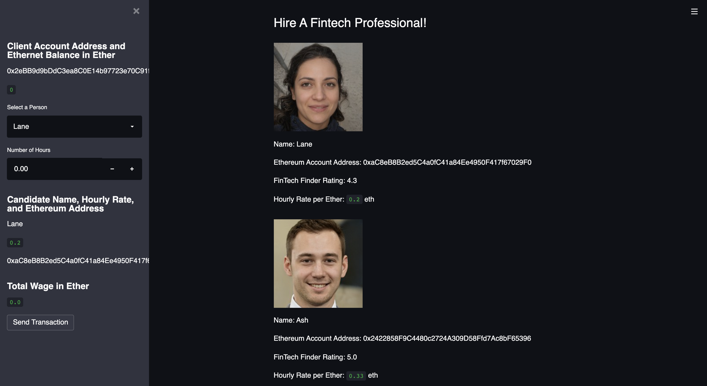
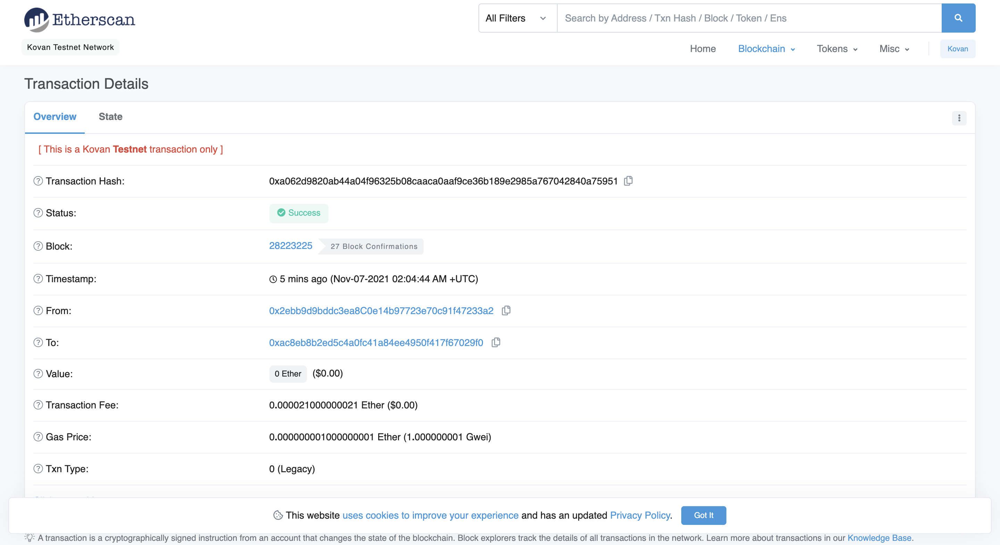

# FinTech-Finder
Fintech Finder is an application that its customers can use to find fintech professionals from among a list of candidates, hire them, and pay them. The Ethereum blockchain network is integrated into the application in order to enable customers to instantly pay fintech professionals whom they hire with cryptocurrency.

---

## Technologies

This project leverages python 3.7 with the following:

* [streamlit](https://pypi.org/project/streamlit/) - Streamlit's open-source app framework is the easiest way for data scientists and machine learning engineers to create beautiful, performant apps in only a few hours!

* [Web3.py](https://web3py.readthedocs.io/en/stable/overview.html) - A Python library for connecting to and performing operations on Ethereum-based blockchains.

* [ethereum-tester](https://pypi.org/project/ethereum-tester/0.1.0a4/) - A Python library that provides access to the tools we’ll use to test Ethereum-based applications.

* [mnemonic](https://pypi.org/project/mnemonic/) - A Python implementation for generating a 12- or 24-word mnemonic seed phrase based on the BIP-39 standard.

* [bip44](https://pypi.org/project/bip44/) - A Python implementation for deriving hierarchical deterministic wallets from a seed phrase based on the BIP-44 standard.

* Infura API - An API that provides instant access to the Ethereum network over HTTPS (i.e., the web). You will need to create an account with Infura.

---

### Installation Guide

Before running the application first install the following dependencies.

```python
  pip install streamlit
  pip install web3.py
  pip install ethereum-tester
  pip install mnemonic
  pip install bip44
```

---

## Examples

Below you will find Pychain visualizations.

### FinTech-Finder Local Deployment through Streamlit:


### Etherscan Transaction Details:


---

## Usage

To use the portfolio management application simply clone the repository and run the **fintech_finder.py** with:

```python
fintech_finder.py

streamlit run fintech_finder.py
```

---

## Contributors

Brought to you by Robert Giannini.
LinkedIn: https://www.linkedin.com/in/robertgianninijr/

---

## License

MIT
